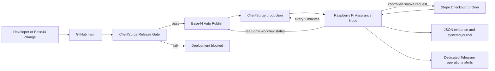

# ClientSurge Raspberry Pi Assurance Node v1

The Assurance Node is an independent watchdog around the ClientSurge cloud deployment chain. GitHub and Base44 remain the production deployment plane. The Raspberry Pi verifies what customers actually receive from the public internet and alerts when the revenue path breaks.

It does **not** host the public site, production database, Stripe webhooks, Twilio webhooks, or Base44 application.

## Architecture



## SyberVision critical path

```text
┌──────────────────────┐    ┌──────────────────────┐    ┌──────────────────────┐    ┌──────────────────────┐    ┌──────────────────────┐
│ 0. START             │───▶│ 1. RELEASE PASSES    │───▶│ 2. BASE44 PUBLISHES  │───▶│ 3. PI VERIFIES LIVE  │───▶│ 4. REVENUE PATH OK   │
│ Code/change enters   │    │ Build + release gate │    │ Production update    │    │ DNS/TLS/routes       │    │ Stripe smoke session │
└──────────────────────┘    └──────────────────────┘    └──────────────────────┘    └──────────────────────┘    └──────────────────────┘
                                                                                              │                           │
                                                                                              ▼                           ▼
                                                                                     ┌──────────────────────┐    ┌──────────────────────┐
                                                                                     │ 5. EVIDENCE STORED  │───▶│ 6. ALERT OR RECOVER  │
                                                                                     │ JSON + journal      │    │ Telegram operations  │
                                                                                     └──────────────────────┘    └──────────────────────┘
```

## What v1 protects

### Public watchdog — every two minutes

- DNS resolution for `clientsurgesystems.com`
- TLS validity and certificate-expiration window
- homepage
- product-signup route
- contact route
- booking route
- HTTP status, content type, app-shell marker, response time
- consecutive-failure suppression to prevent alert spam
- recovery notifications

### Release assurance — every three minutes

- reads the latest completed `Base44 Auto Publish` workflow using a read-only GitHub token
- alerts immediately when the latest publish workflow failed
- independently verifies every new successful publish
- checks the complete public-route profile
- creates a smoke-only Stripe Checkout Session
- stores the verified workflow run ID and commit SHA
- does not repeat expensive checks for an already verified release

### Revenue smoke — every six hours

- checks the full public-route profile
- calls `createCheckoutSession` using `smoke_test: true`
- requires a Stripe Checkout URL, session ID, request ID and expected live mode
- never submits payment
- redacts the Stripe Checkout URL in logs

## Resource isolation

The systemd service is intentionally subordinate to the Pi's trading workload:

- dynamic system user for every run
- no access to `/home`
- no Linux capabilities
- read-only operating-system filesystem
- 50% CPU ceiling
- 256 MB memory ceiling
- low I/O priority
- maximum 32 tasks
- separate `/var/lib/clientsurge-assurance` state
- separate `/run/clientsurge-assurance` locks
- journald logging

## Stage 0 — stop the Windows interruption

Run in an elevated Windows PowerShell window:

```powershell
Disable-ScheduledTask -TaskName "ClientSurge-Base44-SyncMirror"
Get-ScheduledTask -TaskName "ClientSurge-Base44-SyncMirror" |
    Select-Object TaskName, State
```

Leave the task disabled but do not delete it until the Assurance Node has operated successfully for several days.

The existing Windows job is no longer part of the production architecture. GitHub already owns the release gate and Base44 auto-publish chain.

## Stage 1 — install the public watchdog

On the Raspberry Pi:

```bash
ssh neo@bybit-pi
mkdir -p ~/projects
cd ~/projects
```

Clone the private repository using an SSH deploy key or an already authenticated GitHub CLI session:

```bash
git clone git@github.com:stellaragencyai/clientsurge-systems.git
cd clientsurge-systems
git fetch origin
git checkout infra/pi-assurance-node
sudo bash infra/pi-assurance/install.sh
```

The installer immediately runs one watchdog check and enables only the safe two-minute public watchdog.

Check it:

```bash
systemctl status clientsurge-watchdog.timer --no-pager
sudo systemctl status clientsurge-assurance@watchdog.service --no-pager
sudo cat /var/lib/clientsurge-assurance/latest-watchdog.json
journalctl -u 'clientsurge-assurance@*' -n 100 --no-pager
```

## Stage 2 — configure dedicated Telegram operations alerts

Do not reuse the Bybit trading bot. Create a separate ClientSurge operations bot and preferably a separate chat/channel.

Edit the protected configuration:

```bash
sudo nano /etc/clientsurge-assurance/assurance.env
```

Set:

```text
CLIENTSURGE_TELEGRAM_BOT_TOKEN=...
CLIENTSURGE_TELEGRAM_CHAT_ID=...
```

Protect and reload:

```bash
sudo chmod 600 /etc/clientsurge-assurance/assurance.env
sudo systemctl start clientsurge-assurance@watchdog.service
journalctl -u clientsurge-assurance@watchdog.service -n 80 --no-pager
```

## Stage 3 — enable release assurance

Create a fine-grained GitHub token restricted to `stellaragencyai/clientsurge-systems` with **Actions: Read-only**. No write permission is required.

Add it to:

```bash
sudo nano /etc/clientsurge-assurance/assurance.env
```

```text
CLIENTSURGE_GITHUB_TOKEN=github_pat_...
```

Then:

```bash
sudo systemctl enable --now clientsurge-release-assurance.timer
sudo systemctl start clientsurge-assurance@release.service
sudo cat /var/lib/clientsurge-assurance/latest-release.json
```

A new successful Base44 publish will now trigger full public verification and an independent checkout smoke test.

## Stage 4 — enable scheduled revenue protection

Release verification checks revenue after every deployment. The six-hour timer catches failures caused later by Stripe, Base44, Cloudflare, DNS, or configuration drift.

Enable it only after confirming that smoke orders are classified as `environment=smoke` and `dashboard_excluded=true` in production:

```bash
sudo systemctl start clientsurge-assurance@revenue.service
sudo cat /var/lib/clientsurge-assurance/latest-revenue.json
sudo systemctl enable --now clientsurge-revenue-smoke.timer
```

## Evidence locations

```text
/var/lib/clientsurge-assurance/latest-watchdog.json
/var/lib/clientsurge-assurance/latest-release.json
/var/lib/clientsurge-assurance/latest-revenue.json
/var/lib/clientsurge-assurance/release-state.json
/var/lib/clientsurge-assurance/history.jsonl
```

Logs:

```bash
journalctl -u 'clientsurge-assurance@*' --since today --no-pager
journalctl -u 'clientsurge-assurance@*' -f
```

List timers:

```bash
systemctl list-timers 'clientsurge-*' --all
```

## Manual controls

```bash
# Lightweight public check
sudo systemctl start clientsurge-assurance@watchdog.service

# Verify the latest Base44 publish
sudo systemctl start clientsurge-assurance@release.service

# Full public routes + live checkout smoke
sudo systemctl start clientsurge-assurance@revenue.service
```

## Update procedure

```bash
cd ~/projects/clientsurge-systems
git fetch origin
git checkout infra/pi-assurance-node
git pull --ff-only
sudo bash infra/pi-assurance/install.sh
```

The installer preserves the existing root-only environment file.

## Disable or roll back

```bash
sudo systemctl disable --now clientsurge-watchdog.timer
sudo systemctl disable --now clientsurge-release-assurance.timer
sudo systemctl disable --now clientsurge-revenue-smoke.timer
```

To remove installed code while retaining evidence:

```bash
sudo rm -rf /opt/clientsurge-assurance
sudo rm -f /etc/systemd/system/clientsurge-assurance@.service
sudo rm -f /etc/systemd/system/clientsurge-watchdog.timer
sudo rm -f /etc/systemd/system/clientsurge-release-assurance.timer
sudo rm -f /etc/systemd/system/clientsurge-revenue-smoke.timer
sudo systemctl daemon-reload
```

Do not delete `/var/lib/clientsurge-assurance` until its evidence has been backed up.

## Acceptance criteria for v1

The deployment is accepted only when all of these are true:

1. Windows `ClientSurge-Base44-SyncMirror` is disabled.
2. The Pi watchdog executes without opening any desktop window.
3. The light profile passes two consecutive runs.
4. Telegram receives a controlled test failure and a recovery alert.
5. The release timer reads the latest Base44 workflow using read-only credentials.
6. A release run records its workflow run ID and commit SHA.
7. The revenue smoke receives a live Stripe Checkout Session without payment.
8. The generated smoke order is excluded from real sales analytics.
9. Pi CPU, RAM and temperature remain healthy while Bybit services are running.
10. Rebooting the Pi restores all enabled timers automatically.

## Next build phases

- v2: synthetic lead submission and delivery-chain verification
- v3: Twilio/Resend execution and failure-queue checks
- v4: visual regression screenshots and DOM assertions
- v5: performance, SEO and accessibility regression baselines
- v6: encrypted off-device evidence backups
- v7: private operations dashboard and daily executive report
- v8: secondary external monitor so the Pi itself is monitored
